# SP26_B5_PE — Paper No: 4 (Practical Exam)

> **Ghi chú của người chuyển đổi:** File `.docx` gốc không chứa văn bản dạng text — toàn bộ 11 trang là **ảnh chụp/scan** (mỗi trang một ảnh full-page). Vì vậy mình đã:
> 1. Giữ nguyên ảnh gốc từng trang (thư mục `SP26_B5_PE_images/`) để bạn xem chính xác 100% layout, sơ đồ ERD, giao diện, mã màu...
> 2. Chạy OCR (nhận dạng ký tự) để trích văn bản bên dưới mỗi ảnh, giúp bạn copy/paste hoặc tìm kiếm (Ctrl+F) dễ dàng.
>
> **Lưu ý về độ chính xác OCR:** Các bảng, sơ đồ ERD, ảnh chụp giao diện Swagger/HTML và các từ tiếng Việt không dấu (ví dụ "An Sang", "Gala", "Dua Don San Bay", "Su dung Gym/Pool", "Giat La", "Buffet Toi", "Trong", "Dang don"...) có thể bị OCR đọc sai chút ít hoặc mất dấu do ảnh gốc vốn đã không có dấu tiếng Việt hoặc do chất lượng ảnh. **Ảnh gốc luôn là nguồn chính xác nhất** — phần text bên dưới chỉ mang tính tham khảo/hỗ trợ tra cứu.

---

## Mục lục

- [Trang 1 — Instructions & Question 1 (intro)](#trang-1)
- [Trang 2 — ERD sơ đồ CSDL & Danh sách API](#trang-2)
- [Trang 3 — API 1: GET /api/roomtypes & API 2: GET /api/filter-rooms](#trang-3)
- [Trang 4 — API 2 (tiếp) & API 3: POST /api/rooms](#trang-4)
- [Trang 5 — Ví dụ request/response POST /api/rooms](#trang-5)
- [Trang 6 — Response lỗi & API 4: DELETE /api/rooms/{roomId}](#trang-6)
- [Trang 7 — Response DELETE & Question 2 (intro)](#trang-7)
- [Trang 8 — Provided APIs & 3.1 Service/RoomType Management Page](#trang-8)
- [Trang 9 — Search Area & Data Table & 3.2 Room Type Analysis Page](#trang-9)
- [Trang 10 — Room Inventory & Bảng tổng hợp ID phần tử HTML](#trang-10)
- [Trang 11 — Bảng ID (tiếp) & Bảng tổng hợp URL](#trang-11)

---

<a id="trang-1"></a>
## Trang 1

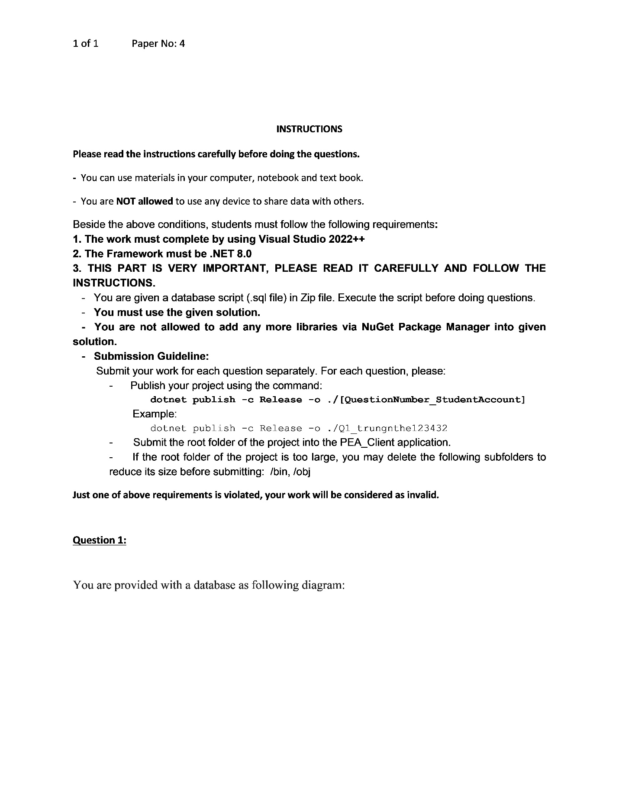

**Văn bản OCR:**

```
Paper No: 4

INSTRUCTIONS
Please read the instructions carefully before doing the questions.
- You can use materials in your computer, notebook and text book.
- You are NOT allowed to use any device to share data with others.

Beside the above conditions, students must follow the following requirements:
1. The work must complete by using Visual Studio 2022++
2. The Framework must be .NET 8.0
3. THIS PART IS VERY IMPORTANT, PLEASE READ IT CAREFULLY AND FOLLOW THE
INSTRUCTIONS.
- You are given a database script (.sql file) in Zip file. Execute the script before doing questions.
- You must use the given solution.
- You are not allowed to add any more libraries via NuGet Package Manager into given
solution.
- Submission Guideline:
Submit your work for each question separately. For each question, please:
- Publish your project using the command:
dotnet publish -c Release -o ./[QuestionNumber_StudentAccount]
Example:
dotnet publish -c Release -o ./Q1_trungnthe123432
- Submit the root folder of the project into the PEA_Client application.
- If the root folder of the project is too large, you may delete the following subfolders to
reduce its size before submitting: /bin, /obj

Just one of above requirements is violated, your work will be considered as invalid.

Question 1:

You are provided with a database as following diagram:
```

---

<a id="trang-2"></a>
## Trang 2

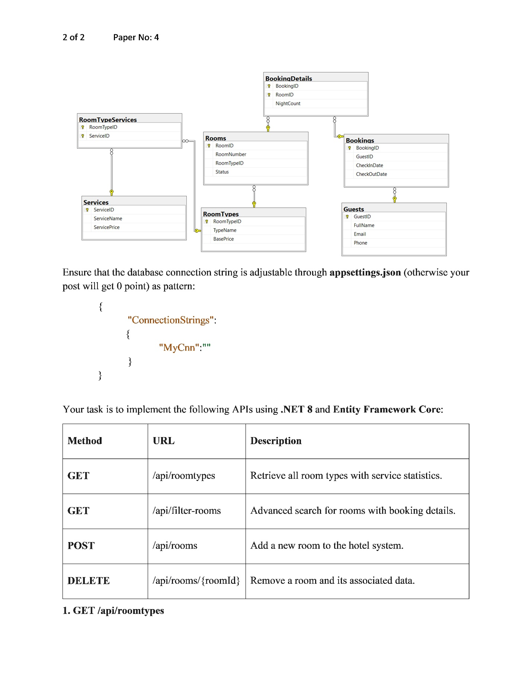

### Phân tích chi tiết sơ đồ CSDL (ERD)

Đây là sơ đồ CSDL cho một hệ thống **quản lý đặt phòng khách sạn**, gồm 7 bảng:

#### Các bảng chính

**`RoomTypes` — Loại phòng**
| Cột | Vai trò |
|---|---|
| **RoomTypeID** | Khóa chính (PK) |
| TypeName | Tên loại phòng (VD: Standard Single, Suite Ocean...) |
| BasePrice | Giá cơ bản của loại phòng |

**`Rooms` — Phòng**
| Cột | Vai trò |
|---|---|
| **RoomID** | Khóa chính (PK) |
| RoomNumber | Số phòng (VD: P101) |
| RoomTypeID | Khóa ngoại (FK) → tham chiếu `RoomTypes` |
| Status | Trạng thái phòng (VD: Trống, Đang ở) |

**`Services` — Dịch vụ**
| Cột | Vai trò |
|---|---|
| **ServiceID** | Khóa chính (PK) |
| ServiceName | Tên dịch vụ (VD: Ăn sáng, Giặt là...) |
| ServicePrice | Giá dịch vụ |

**`RoomTypeServices` — Bảng trung gian (nối)**
| Cột | Vai trò |
|---|---|
| **RoomTypeID** | Khóa chính kết hợp (PK) + Khóa ngoại → `RoomTypes` |
| **ServiceID** | Khóa chính kết hợp (PK) + Khóa ngoại → `Services` |

→ Giải quyết quan hệ **nhiều-nhiều** giữa `RoomTypes` và `Services`: một loại phòng có thể đi kèm nhiều dịch vụ, và một dịch vụ có thể áp dụng cho nhiều loại phòng.

**`Guests` — Khách hàng**
| Cột | Vai trò |
|---|---|
| **GuestID** | Khóa chính (PK) |
| FullName | Họ tên |
| Email | Email |
| Phone | Số điện thoại |

**`Bookings` — Lượt đặt phòng**
| Cột | Vai trò |
|---|---|
| **BookingID** | Khóa chính (PK) |
| GuestID | Khóa ngoại (FK) → tham chiếu `Guests` |
| CheckInDate | Ngày nhận phòng |
| CheckOutDate | Ngày trả phòng |

**`BookingDetails` — Chi tiết đặt phòng (bảng trung gian)**
| Cột | Vai trò |
|---|---|
| **BookingID** | Khóa chính kết hợp (PK) + Khóa ngoại → `Bookings` |
| **RoomID** | Khóa chính kết hợp (PK) + Khóa ngoại → `Rooms` |
| NightCount | Số đêm ở của phòng đó trong lượt đặt này |

→ Bảng nối giữa `Bookings` và `Rooms`: một lượt đặt có thể gồm **nhiều phòng**, và một phòng có thể xuất hiện trong **nhiều lượt đặt** khác nhau (theo thời gian). `NightCount` cho biết số đêm ở riêng của từng phòng trong lượt đặt đó.

#### Tổng hợp quan hệ (cardinality)

| Quan hệ | Kiểu | Ý nghĩa |
|---|---|---|
| `RoomTypes` — `Rooms` | 1 — n | Một loại phòng có nhiều phòng thực tế |
| `RoomTypes` — `RoomTypeServices` — `Services` | n — n | Một loại phòng có nhiều dịch vụ, một dịch vụ dùng cho nhiều loại phòng |
| `Guests` — `Bookings` | 1 — n | Một khách có thể có nhiều lượt đặt |
| `Bookings` — `BookingDetails` — `Rooms` | n — n | Một lượt đặt có thể gồm nhiều phòng; một phòng có thể thuộc nhiều lượt đặt (khác thời điểm) |

#### Tóm tắt luồng nghiệp vụ

1. Khách sạn có các **loại phòng** (`RoomTypes`), mỗi loại có nhiều **phòng cụ thể** (`Rooms`) và đi kèm một số **dịch vụ** (`Services`) qua bảng nối `RoomTypeServices`.
2. **Khách hàng** (`Guests`) tạo một **lượt đặt phòng** (`Bookings`) gồm ngày nhận/trả phòng.
3. Mỗi lượt đặt có thể chứa **một hoặc nhiều phòng**, chi tiết được lưu ở `BookingDetails` (bao gồm số đêm ở cho từng phòng — vì các phòng trong cùng một booking có thể ở số đêm khác nhau).

**Văn bản OCR (thô, tham khảo thêm):**

```
2 of 2                                                              Paper No: 4

BookingDetails                RoomTypeServices              Rooms
  BookingID                     RoomTypeID                    RoomID
  RoomID                        ServiceID                     RoomNumber
  NightCount

Bookings                       Services                      Guests
  BookingID                     ServiceID                     GuestID
  GuestID                       ServiceName                   FullName
  CheckinDate                                                 Email
  CheckOutDate                                                Phone
  RoomTypeID
  Status

RoomTypes
  RoomTypeID
  TypeName
  BasePrice
  ServicePrice

Ensure that the database connection string is adjustable through appsettings.json (otherwise your
post will get 0 point) as pattern:

{
  "ConnectionStrings":
  {
    "MyCnn": "..."
  }
}

Your task is to implement the following APIs using .NET 8 and Entity Framework Core:

| Method | URL                          | Description                                             |
|--------|------------------------------|-----------------------------------------------------------|
| GET    | /api/roomtypes               | Retrieve all room types with service statistics.          |
| GET    | /api/filter-rooms            | Advanced search for rooms with booking details.            |
| POST   | /api/rooms                   | Add a new room to the hotel system.                        |
| DELETE | /api/rooms/{roomId}          | Remove a room and its associated data.                     |

1. GET /api/roomtypes
```

---

<a id="trang-3"></a>
## Trang 3

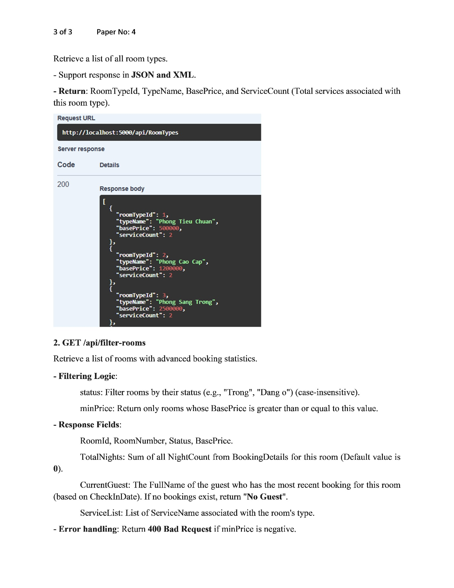

**Văn bản OCR:**

```
3 of 3                                                              Paper No: 4

Retrieve a list of all room types.
- Support response in JSON and XML.
- Return: RoomTypeId, TypeName, BasePrice, and ServiceCount (Total services associated with
  this room type).

Request URL
http://localhost:5000/api/RoomTypes

Server response
Code    Details
200     Response body
        [
          {
            "roomTypeId": ...,
            "typeName": ...,
            "basePrice": ...,
            "serviceCount": ...
          },
          {
            "serviceCount": ...
          }
        ]

2. GET /api/filter-rooms
Retrieve a list of rooms with advanced booking statistics.
- Filtering Logic:
  status: Filter rooms by their status (e.g., "Trong", "Dang o") (case-insensitive).
  minPrice: Return only rooms whose BasePrice is greater than or equal to this value.
- Response Fields:
  RoomId, RoomNumber, Status, BasePrice.
  TotalNights: Sum of all NightCount from BookingDetails for this room (Default value is 0).
  CurrentGuest: The FullName of the guest who has the most recent booking for this room
  (based on CheckInDate). If no bookings exist, return "No Guest".
  ServiceList: List of ServiceName associated with the room's type.
- Error handling: Return 400 Bad Request if minPrice is negative.
```

---

<a id="trang-4"></a>
## Trang 4

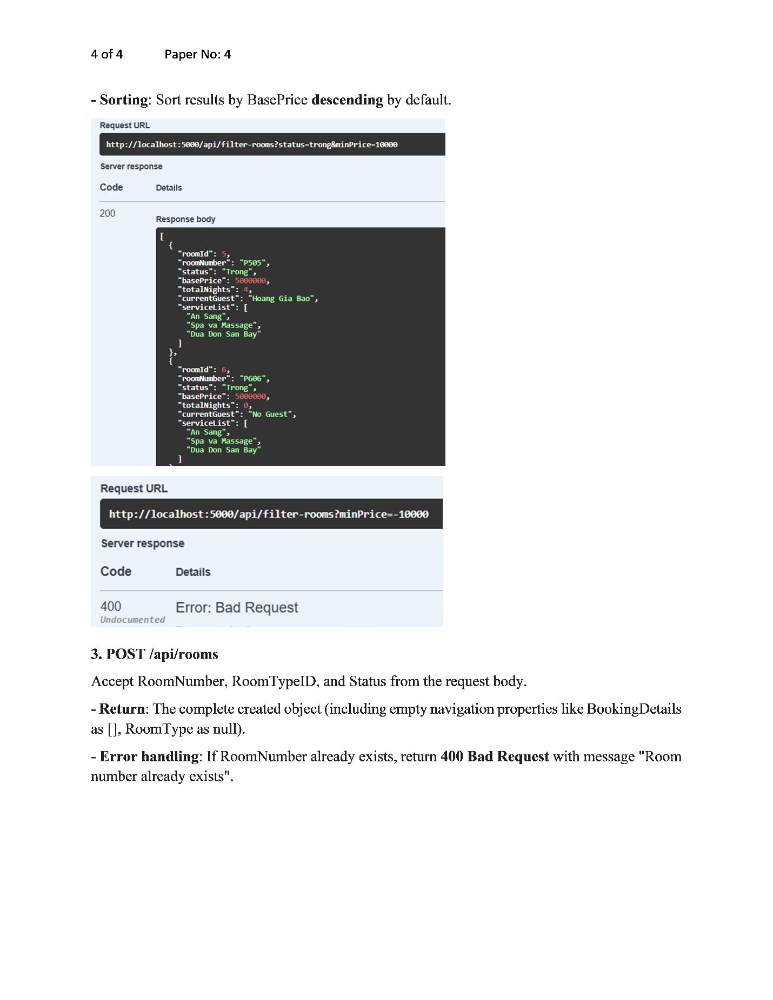

**Văn bản OCR:**

```
4 of 4                                                              Paper No: 4

- Sorting: Sort results by BasePrice descending by default.

Request URL
http://localhost:5000/api/filter-rooms?status=...

Server response
Code    Details
200     Response body
        [ ... ]

Server response
Code    Details
400     Error: Bad Request
        Undocumented

3. POST /api/rooms
Accept RoomNumber, RoomTypeID, and Status from the request body.
- Return: The complete created object (including empty navigation properties like BookingDetails
  as [], RoomType as null).
- Error handling: If RoomNumber already exists, return 400 Bad Request with message "Room
  number already exists".
```

---

<a id="trang-5"></a>
## Trang 5

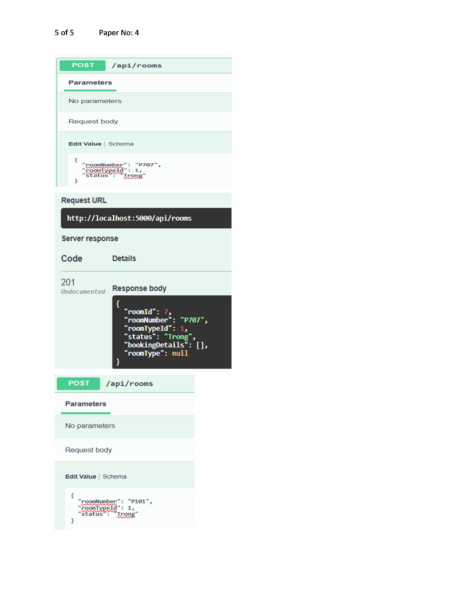

**Văn bản OCR:**

```
5 of 5                                                              Paper No: 4

Parameters
No parameters

Request body
Edit | Value | Schema
{
  "roomNumber": "P707",
  "roomTypeId": 1,
  "status": "Trong"
}

Request URL
http://localhost:5000/api/rooms

Server response
Code    Details
201     Undocumented
        Response body
        {
          "roomType": ...
        }

Parameters
No parameters

Request body
Edit | Value | Schema
{
  "roomNumber": "P101",
  "roomTypeId": 1,
  "status": "trong"
}
```

---

<a id="trang-6"></a>
## Trang 6

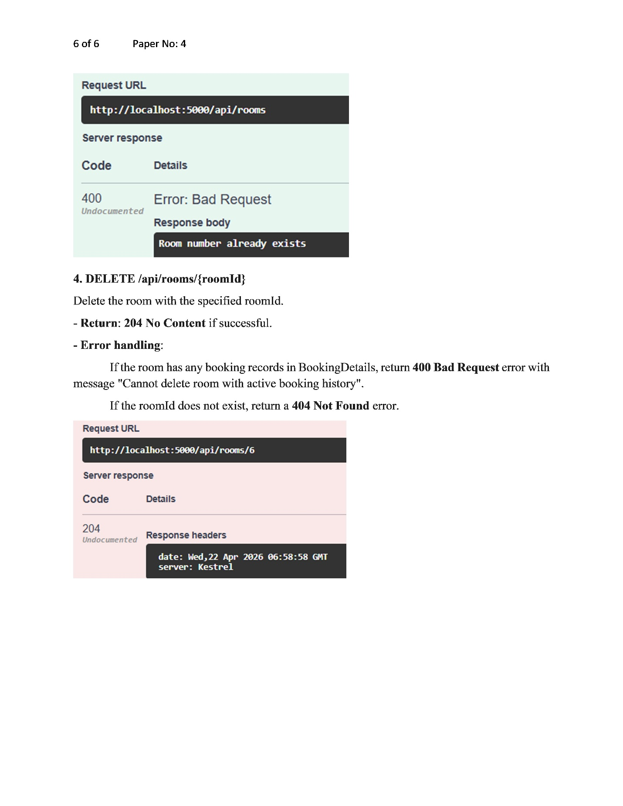

**Văn bản OCR:**

```
6 of 6                                                              Paper No: 4

Request URL
http://localhost:5000/api/rooms

Server response
Code    Details
400     Error: Bad Request
        Undocumented
        Response body
        Room number already exists

4. DELETE /api/rooms/{roomId}
Delete the room with the specified roomId.
- Return: 204 No Content if successful.
- Error handling:
  If the room has any booking records in BookingDetails, return 400 Bad Request error with
  message "Cannot delete room with active booking history".
  If the roomId does not exist, return a 404 Not Found error.

Request URL
http://localhost:5000/api/rooms/6

Server response
Code    Details
204
Response headers
        Undocumented
        date: Wed, 22 Apr 2026 06:58:58 GMT
        server: Kestrel
```

---

<a id="trang-7"></a>
## Trang 7

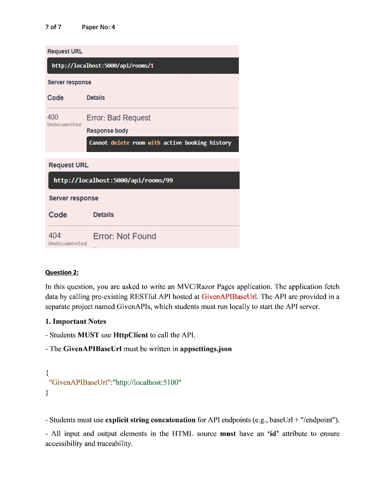

**Văn bản OCR:**

```
7 of 7                                                              Paper No: 4

Request URL
http://localhost:5000/api/rooms/1

Server response
Code    Details
400     Error: Bad Request
        Undocumented
        Response body
        Cannot delete room with active booking history

Request URL
http://localhost:5000/api/rooms/99

Server response
Code    Details
404     Error: Not Found
        Undocumented

Question 2:

In this question, you are asked to write an MVC/Razor Pages application. The application fetches
data by calling a pre-existing RESTful API hosted at GivenAPIBaseUrl. The API is provided in a
separate project named GivenAPIs, which students must run locally to start the API server.

1. Important Notes
- Students MUST use HttpClient to call the API.
- The GivenAPIBaseUrl must be written in appsettings.json

{
  "GivenAPIBaseUrl": "http://localhost:5100"
}

- Students must use explicit string concatenation for API endpoints (e.g., baseUrl + "/endpoint").
- All input and output elements in the HTML source must have an 'id' attribute to ensure
  accessibility and traceability.
```

---

<a id="trang-8"></a>
## Trang 8

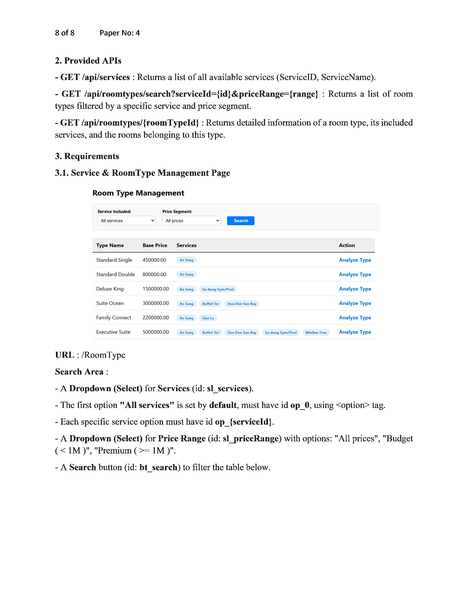

**Văn bản OCR:**

```
8 of 8                                                              Paper No: 4

2. Provided APIs
- GET /api/services : Returns a list of all available services (ServiceID, ServiceName).
- GET /api/roomtypes/search?serviceId={id}&priceRange={range} : Returns a list of room
  types filtered by a specific service and price segment.
- GET /api/roomtypes/{roomTypeId} : Returns detailed information of a room type, its included
  services, and the rooms belonging to this type.

3. Requirements

3.1. Service & RoomType Management Page

--- Giao diện mẫu (bảng minh họa) ---
Room Type Management

Service Included: [All services ▾]     Price Segment: [All prices ▾]     [Search]

| Type Name        | Base Price   | Services                                                              | Action        |
|-------------------|-------------|------------------------------------------------------------------------|---------------|
| Standard Single   | 450000.00   | An Sang                                                                 | Analyze Type  |
| Standard Double   | 800000.00   | An Sang                                                                 | Analyze Type  |
| Deluxe King       | 1500000.00  | An Sang, Su dung Gym/Pool                                               | Analyze Type  |
| Suite Ocean       | 3000000.00  | An Sang, Buffet Toi, Dua Don San Bay                                    | Analyze Type  |
| Family Connect    | 2200000.00  | An Sang, Giat La                                                        | Analyze Type  |
| Executive Suite   | 5000000.00  | An Sang, Buffet Toi, Dua Don San Bay, Su dung Gym/Pool, Minibar Free    | Analyze Type  |

URL : /RoomType

Search Area :
- A Dropdown (Select) for Services (id: sl_services).
- The first option "All services" is set by default, must have id op_0, using <option> tag.
- Each specific service option must have id op_{serviceId}.
- A Dropdown (Select) for Price Range (id: sl_priceRange) with options: "All prices", "Budget
  (< 1M)", "Premium (>= 1M)".
- A Search button (id: bt_search) to filter the table below.
```

---

<a id="trang-9"></a>
## Trang 9

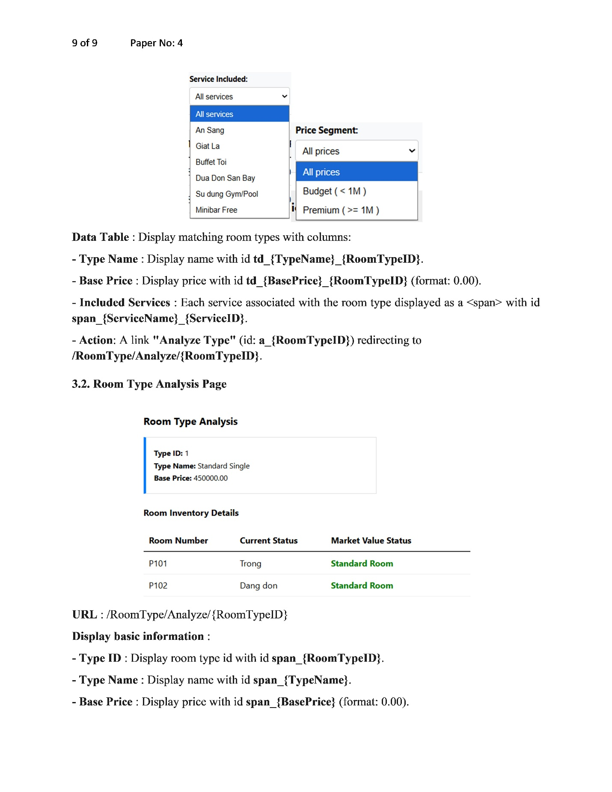

**Văn bản OCR:**

```
9 of 9                                                              Paper No: 4

--- Giao diện mẫu: Dropdown Service ---
Service Included:
  All services
  An Sang
  Gala
  Buffet Toi
  Dua Don San Bay
  Su dung Gym/Pool
  Minibar Free

Price Segment:
  All prices
  Budget (< 1M)
  Premium (>= 1M)

Data Table : Display matching room types with columns:
- Type Name : Display name with id td_{TypeName}_{RoomTypeID}.
- Base Price : Display price with id td_{BasePrice}_{RoomTypeID} (format: 0.00).
- Included Services : Each service associated with the room type displayed as a <span> with id
  span_{ServiceName}_{ServiceID}.
- Action: A link "Analyze Type" (id: a_{RoomTypeID}) redirecting to
  /RoomType/Analyze/{RoomTypeID}.

3.2. Room Type Analysis Page

--- Giao diện mẫu ---
Room Type Analysis

Type ID: 1
Type Name: Standard Single
Base Price: 450000.00

Room Inventory Details

| Room Number | Current Status | Market Value Status |
|-------------|----------------|----------------------|
| P101        | Trong          | Standard Room        |
| P102        | Dang don       | Standard Room        |

URL : /RoomType/Analyze/{RoomTypeID}

Display basic information :
- Type ID : Display room type id with id span_{RoomTypeID}.
- Type Name : Display name with id span_{TypeName}.
- Base Price : Display price with id span_{BasePrice} (format: 0.00).
```

---

<a id="trang-10"></a>
## Trang 10

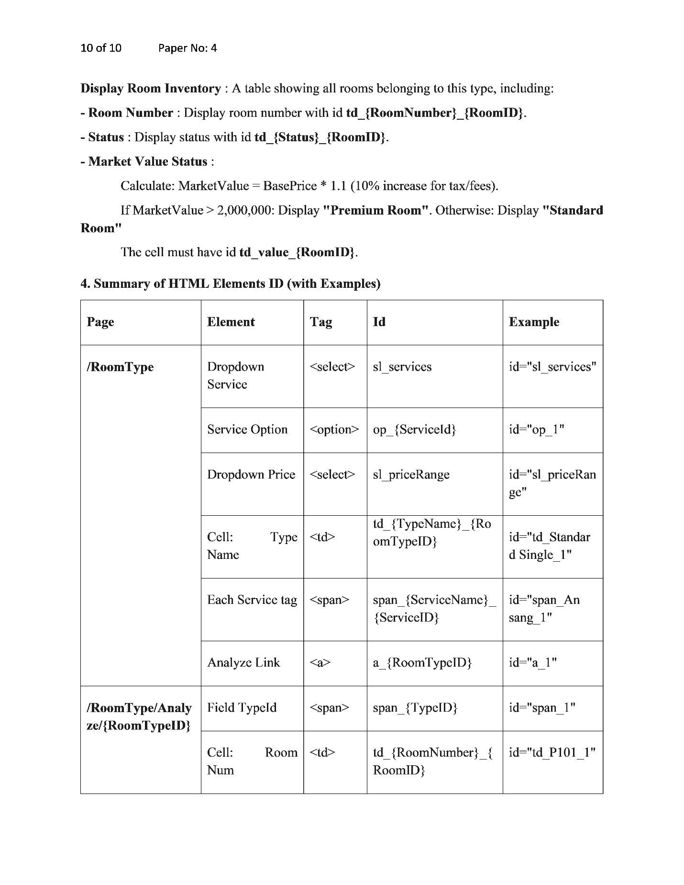

**Văn bản OCR:**

```
10 of 10                                                            Paper No: 4

Display Room Inventory : A table showing all rooms belonging to this type, including:
- Room Number : Display room number with id td_{RoomNumber}_{RoomID}.
- Status : Display status with id td_{Status}_{RoomID}.
- Market Value Status :
  Calculate: MarketValue = BasePrice * 1.1 (10% increase for tax/fees).
  If MarketValue > 2,000,000: Display "Premium Room". Otherwise: Display "Standard Room".
  The cell must have id td_value_{RoomID}.

4. Summary of HTML Elements ID (with Examples)

| Page                              | Element                  | Tag        | Id                                      | Example                          |
|------------------------------------|--------------------------|------------|------------------------------------------|-----------------------------------|
| /RoomType                          | Service Dropdown         | <select>   | sl_services                               | id="sl_services"                 |
| /RoomType                          | Service Option           | <option>   | op_{ServiceId}                            | id="op_1"                        |
| /RoomType                          | Price Dropdown            | <select>   | sl_priceRange                              | id="sl_priceRange"                |
| /RoomType                          | Cell: Type Name           | <td>       | td_{TypeName}_{RoomTypeID}                | id="td_StandardSingle_1"          |
| /RoomType                          | Each Service tag          | <span>     | span_{ServiceName}_{ServiceID}            | id="span_AnSang_1"                |
| /RoomType                          | Analyze Link              | <a>        | a_{RoomTypeID}                             | id="a_1"                          |
| /RoomType/Analyze/{RoomTypeID}     | Field TypeId              | <span>     | span_{TypeID}                              | id="span_1"                       |
| /RoomType/Analyze/{RoomTypeID}     | Cell: Room Number         | <td>       | td_{RoomNumber}_{RoomID}                  | id="td_P101_1"                    |
```

---

<a id="trang-11"></a>
## Trang 11

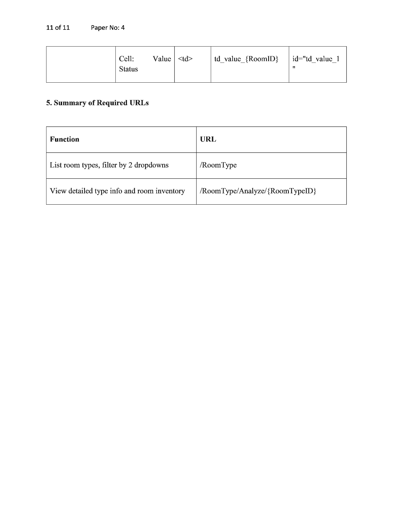

**Văn bản OCR:**

```
11 of 11                                                            Paper No: 4

| Page                              | Element                  | Tag   | Id                        | Example              |
|------------------------------------|--------------------------|-------|---------------------------|------------------------|
| /RoomType/Analyze/{RoomTypeID}     | Cell: Value Status        | <td>  | td_value_{RoomID}          | id="td_value_1"        |

5. Summary of Required URLs

| Function                                                | URL                                      |
|----------------------------------------------------------|--------------------------------------------|
| List room types, filter by 2 dropdowns                    | /RoomType                                  |
| View detailed type info and room inventory                 | /RoomType/Analyze/{RoomTypeID}              |
```

---

*Hết tài liệu — 11/11 trang.*
